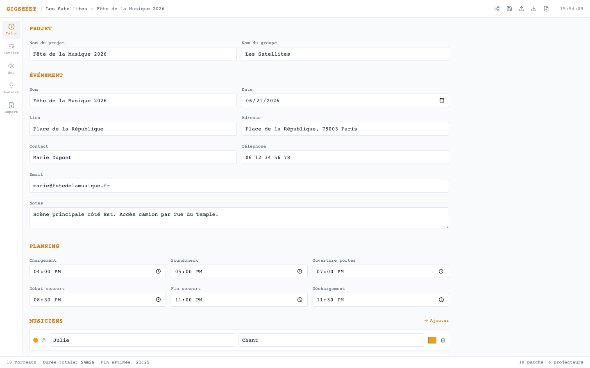

# GigSheet

Concert setlist & technical documentation app for live musicians and sound/lighting engineers.

Plan your gig from setlist to stage plot, sound patches, monitor mixes, lighting cues — and export everything as printable sheets ready for the venue.

**[Try it live](https://dwursteisen.github.io/GigSheet/)**



## Features

- **Event info & schedule** — Venue details, contacts, load-in/soundcheck/show times
- **Setlist** — Songs, pauses, set headers with key, BPM, duration and notes
- **Stage plot** — Drag-and-drop musician positioning on a visual stage
- **Sound patches** — Channel list with instruments, mics, DI boxes and stands
- **Song-track matrix** — Per-song active channels at a glance
- **Monitor mixes** — Per-musician monitor return levels
- **Lighting** — Fixture inventory, DMX addresses, stage positions, and per-song cue programming with RGBW color control
- **Printable exports** — Rundown, sound sheet and lighting sheet ready to print or save as PDF
- **Share via URL** — Send your project to bandmates with a single link
- **Offline-first** — Everything is saved locally in the browser, no account needed

## Getting started

```bash
npm install
npm run dev
```

## Tech stack

React 19, TypeScript, Tailwind CSS v4, Vite. No backend — runs entirely in the browser with localStorage persistence.
